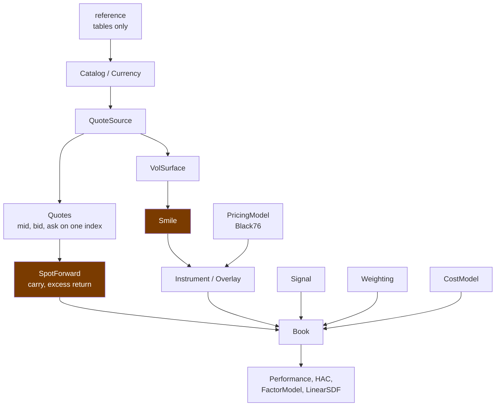
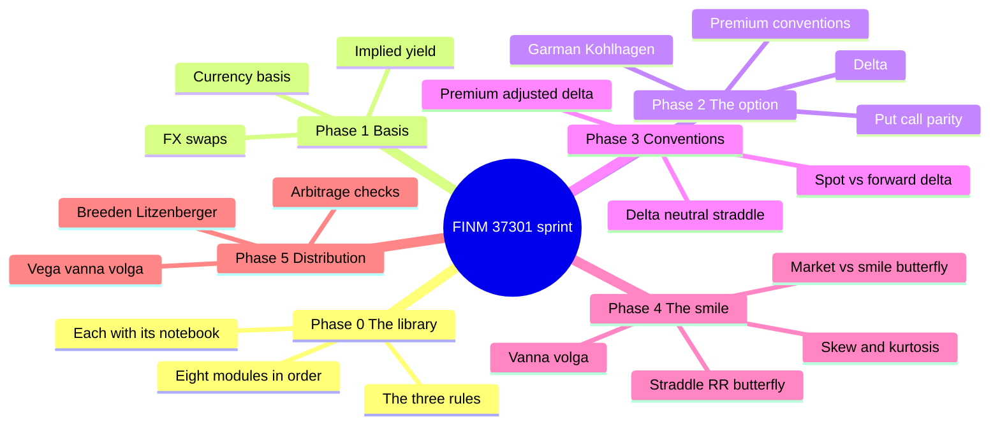
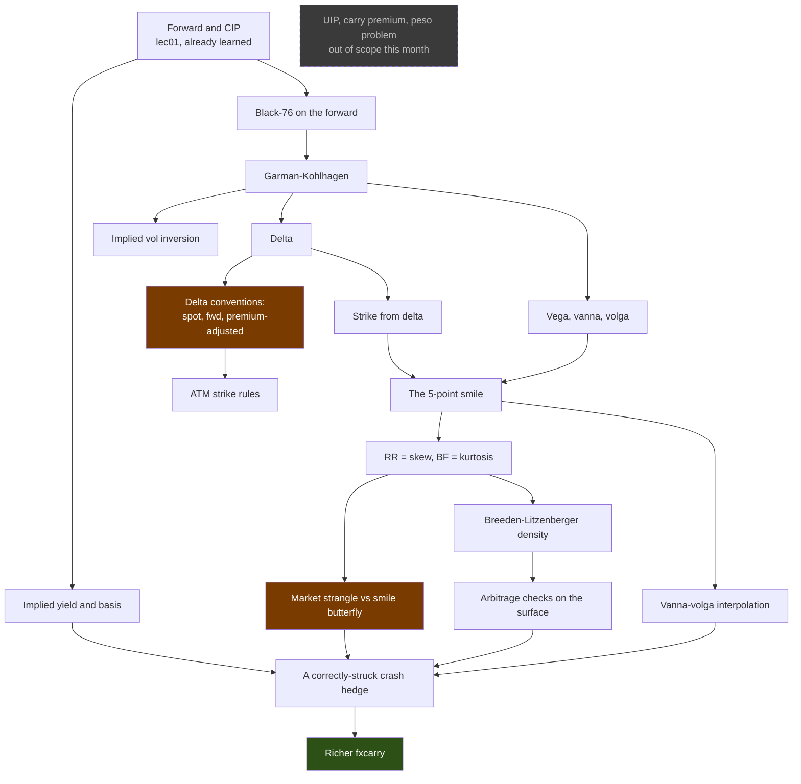

# Month plan: FX theory, library ownership, econometrics, C++

Four weeks, ending with the project. Week 1 is the FINM 37301 sprint, cut into six phases;
weeks 2-4 run three tracks in parallel.

Phases are units of work, not days. A phase ends when its done-when is met, and a good day
gets through two or three of the light ones or one of the heavy ones. Phases 3 and 4 are the
heavy ones.

## Outcomes

1. FX theory solid: what lec01-04 cover, from the books.
2. `fxcarry` owned as rebuilt. The library is now eight modules of classes rather than
   fourteen of functions, so ownership means judging the new decisions: what each class
   holds, what its interface promises, and which of those promises is untested. Plus the
   option-convention and smile machinery the crash-hedged carry still works around.
   Strategy extends this package rather than rebuilding it.
3. BUSN 41902 reviewed, at minimum the topics that explain econometrics already running
   here. See the [binding map](busn41902_binding.md).
4. QuantLib's FX C++ readable: QuantNet through Level 5. See the
   [C++ track](cpp_quantlib_track.md).

## At a glance

| Week | FX theory + library | Econometrics | C++ |
|---|---|---|---|
| 1 | Compressed to a 4.5-day sprint this cycle, [fx_sprint_4day.md](fx_sprint_4day.md): the FINM 33000 prerequisite phase then phases 2-5. Phase 0, Phase 1's Derive/Verify/Own/Build, and every phase's Own and Build move to week 2 | none | Level 1 |
| 2 | Harden: premium-adjusted everywhere, surface arbitrage checks, re-run the deck | Block A (OLS), start B | Levels 2-3 |
| 3 | Apply: rebuild the crash-hedged legs on the corrected library | Finish B (HAC), then F (GMM) | Level 4 |
| 4 | Consolidate: tests, honest docstrings, written note | D (serial correlation), G (bootstrap), H (factors) | Level 5, then read the QuantLib FX source |

Econometrics runs Hayashi first, lecture note second. ESL is deferred to later
advanced-methods work. Week 1 is single-track on purpose.

## Scope rules

- The lectures are the filter. If lec01-04 don't cover it, it's out. UIP, the carry premium
  and the peso problem are deliberately excluded and come later, through papers. Regime
  conditioning joins them; the reading is scoped in
  [Deferred: regime conditioning](#deferred-regime-conditioning-of-the-sold-rung).
- The library is not standalone. Generic only within carry work. If the crash-hedged carry
  doesn't need it, it doesn't get written.
- C++ stops at Level 5. Reading fluency in QuantLib's FX source, nothing more.

## The rule

> Nothing counts as understood until you have derived it by hand, reproduced it on your own
> data, and made an independent check agree.

Treat any Python here you didn't write as an unverified claim. The rebuild changed which
claims are outstanding. The two quantitative docstring claims the old `options.py` made are
gone with it, and what stands now is:

- `Black76` says premium-adjusted deltas "have no closed-form inverse and are not
  implemented". A scope claim, and phase 3 is where it stops being a limitation and becomes
  a choice.
- `Black76.value` says a missing volatility stays missing rather than becoming intrinsic.
  Behavioural, and notebook `05_options` already asserts it.
- `Smile.vol` implements the smile-butterfly convention in three additions without naming
  it as such. Not a false claim, an unstated one, and phase 4 is where the market strangle
  makes the distinction matter.
- `reference.POINT_SCALE`'s comments say each non-default scale was pinned by asking which
  divisor makes implied carry agree with a plausible differential. Notebook `08_reference`
  reproduces that for JPY. Nine other non-default scales rest on the comment.

QuantLib is not used as an oracle. Matching someone else's pricer tells you two numbers
agree, not why either is right. Verify instead, in order of preference: hand computation;
model-free identities (put-call parity, delta round-trip, unit-mass density, an
interpolation repricing its own anchors); limiting cases (σ→0, T→0, call=put at K=F); a
second implementation you wrote (Monte Carlo, finite differences); and market anchors.

## Phase 0: read the library as it now stands

Deferred to week 2 this cycle; see [fx_sprint_4day.md](fx_sprint_4day.md).

The orientation pass, and the replacement for the retired `reading-fxcarry.md`, which
described modules that no longer exist. Eight modules, 2,723 lines, down from fourteen and
2,956. The difficulty is not volume: it is that five or six sign conventions have to be
right at once or the numbers are quietly wrong rather than loudly broken.

Read in dependency order. Each module has a tutorial notebook that walks its classes on real
quotes and ends in an assertion, so the pairing is the path.

| Order | Module | Lines | Notebook | What it owns |
|---|---|---|---|---|
| 1 | `reference` | 378 | `08_reference` | Ticker tables, market conventions, analytics defaults. Computes nothing. |
| 2 | `catalog` | 302 | `01_catalog` | `Currency`, `Catalog`, `TickerId`. Identity, and what follows from a pair. |
| 3 | `quotes` | 286 | `02_quotes` | `QuoteSource`, `ParquetSource`, `Quotes`. The one read path. |
| 4 | `curves` | 173 | `03_curves` | `SpotForward`. Spot, outright forward, carry, both return conventions. |
| 5 | `vol` | 286 | `04_vol` | `Smile`, `VolSurface`. The quoted smile, oriented once. |
| 6 | `options` | 411 | `05_options` | `Black76`, `Instrument`, `Overlay`. Pricing, positions, hedges. |
| 7 | `strategy` | 357 | `06_strategy` | `Signal`, `Weighting`, `CostModel`, `Book`. |
| 8 | `stats` | 530 | `07_stats` | `Performance`, `HAC`, `Realized`, `FactorModel`, `LinearSDF`, `Shrinkage`. |

How the pieces fit:



The amber boxes carry the sign conventions. Everything else is plumbing by comparison.

**Three rules run through the whole package**, and they explain most of what looks odd on a
first read.

1. No module holds a ticker string except `reference`. A ticker anywhere else is a bug.
2. A signal is indexed by the date its information was known. `Book.holdings` performs the
   library's only shift, so the absence of look-ahead is a property of one line rather than
   a convention everyone has to remember.
3. Bid only ever meets bid. `Quotes.apply` walks the three sides positionally, because
   crossing the spread by accident pays a negative transaction cost, which looks like a
   profitable strategy.

**Method for the pass.** Read the module's docstring and signatures first, predict what a
call returns, then open the notebook and see whether you were right. A divergence is either
your gap or a bug, and both are worth writing down. Read bodies last, and only where the
prediction failed or the convention is load-bearing.

*Entry condition.* None. This is the first thing.

*Done when* you can answer, without opening the source: where the only shift is; why
`fwd_root` is not the ISO code for seven currencies; which way `to_usd_per_fcu` points and
what breaks if it points the other way; why a yen call is the quoted put side; and what a
`Quotes` object guarantees that three loose frames do not.

## Owning the library

Scope is `src/fxcarry/` only. `research/crash_hedged/` is strategy: rough by design and
likely to change, so owning it now would mean owning a draft. The library is what persists.

"Try to own" means the code gets changed. Every class and method you read ends in one of
three verdicts:

- Keep: it does what it claims, and something calls it.
- Fix: right idea, wrong convention, missing guard, misleading docstring.
- Delete: nothing outside its own tests calls it, or it duplicates something better.

A reading pass that changes nothing probably hasn't found anything. Record all three
verdicts; a keep you can defend counts as much as a deletion.

`docs/notes/read-log.md` already works: it found a day-count error, a dead code path whose
tests built a shape reality never produces, and a typo'd public name. Keep what makes it
work, meaning the "what it decides for me" column, questions parked rather than answered
inline, bit-identical verification against real parquets, and reading against the paper
rather than the code's own logic. Its per-module line counts are now stale, since the files
they referred to are gone; start the counts again against the eight modules above.

Five tactics, aimed at how AI code fails: plausible and self-consistent, wrong against an
external referent, so reading for internal coherence finds nothing.

1. Trace one number end-to-end first. A book Sharpe backwards through
   `Book → Signal and Weighting → SpotForward → Quotes → QuoteSource → Catalog → reference`.
   Notebooks `06_strategy` and `07_stats` already walk that path forwards, which makes them
   the cheapest way in.
2. Predict, then run. Hand-compute one case from the signature and docstring before reading
   the body.
3. Work the convention checklist: orientation and sign, units and scale, day count, time
   alignment (the forward struck at $t$ against the spot that settles it at $t+1$), NaN
   versus silent fill, degrees of freedom and lag choice. Every bug found so far is on it.
4. Treat tests as suspects. The best catch so far was a green suite on a synthetic fixture.
   Ask what the test doesn't cover, and whether its fixture resembles the real parquet.
5. Break it to find consumers. Comment it out, run the suite. If nothing fails it's dead
   code. If something fails you have the dependency graph.

### Live items

Rewritten against the rebuilt library. The old entries pointed at `io.py` and
`constants.py`, and both modules are gone.

| Item | State |
|---|---|
| Day count | Open, and sharper than before. `reference.DAY_COUNT:125` is defined and read nowhere in `src/` or `tests/`. The 30/360 approximation the old `io.py` documented went with the module, so the question is now whether anything should be using it at all. |
| Point scales past JPY | Nine non-default entries in `reference.POINT_SCALE` rest on a comment describing how they were pinned. Notebook `08_reference` reproduces the argument for JPY only. |
| Macro tables unverified | `reference.MACRO_TICKERS` and `MACRO_INDICATORS` have never been checked against a terminal, and no macro series exists anywhere in `data/raw`. Notebook `08_reference` says so plainly; nothing resolves it. |
| Legacy euro comment is wrong | `reference.py:66-68` says those currencies' data "ends 1998-12-31". It runs to 2026-07-15, as EURUSD rescaled by the frozen conversion factor, so the comment's conclusion is right and its stated reason is false. Fix the reason, since a reader who checks may conclude the exclusion is unjustified. |
| `RollingOLS` unexported | Reachable only as `fxcarry.stats.RollingOLS`, unlike every other estimator. Deliberate, or an oversight in `__init__`? |

Log the line count when you review a module; diffing against it is how you notice ownership
slipping.

### What gets owned when, and how deeply

Own a module when you have the theory to judge it. Reading `stats` before deriving HAC
catches nothing. Three depths:

- Deep: line by line, against the derivation you just did.
- Delta: only what changed since the read-log recorded it.
- Interface: what shapes flow through, what is public, what a caller may rely on.

| Phase | Deep | Interface |
|---|---|---|
| 0 | none, this pass is orientation | all eight |
| 1 | `curves`, `catalog` | `quotes` |
| 2 | `options`, the pricing layer | `reference` |
| 3 | `options`, the delta inversion | none |
| 4 | `vol` | none |
| 5 | none new; the redundancy sweep instead | `strategy`, `stats` seams |
| Weeks 2-3 | `strategy` | none |
| Weeks 3-4 | `stats` (blocks B, F, H) | none |

Out of scope this month: `research/crash_hedged/*`, which is strategy rather than library.

## Roadmap





The amber boxes are where the library is known to cut a corner. They get phases 3 and 4.

## What the sprint adds to `fxcarry`

Deferred to week 2 this cycle, alongside Phase 0 and every phase's Own block; see [fx_sprint_4day.md](fx_sprint_4day.md).

Your rule: a function with no consumer outside its own tests shouldn't be in the library.

All four additions below were confirmed absent from the rebuilt library, so none of this is
already done under a new name.

| Phase | Change | Where it lands | Called by |
|---|---|---|---|
| 1 | Hardening only: orientation and scale tests | `tests/test_catalog.py`, `tests/test_curves.py` | `SpotForward.from_quotes` |
| 3 | `Black76.strike_from_delta` to all four conventions; `atm_strike` to the other ATM rules | `src/fxcarry/options.py` | `Vanilla.from_delta`, `research/crash_hedged/hedged_carry.py` |
| 4 | The market-strangle convention on `Smile` (§4.9) | `src/fxcarry/vol.py` | `Book` overlays, `research/` |

Into a notebook until a caller appears: `implied_vol` (phase 2), vanna-volga (phase 4),
`vega`/`vanna`/`volga` and `implied_density` (phase 5). Writing them is still the point: the
understanding is the deliverable, and a caller can promote them later.

## Sources

| Source | Location |
|---|---|
| FINM 37301 notes, the filter | `docs/books/finm37301/src/lec01-04.tex` |
| Shamah, *A Foreign Exchange Primer* (2nd ed.) | `docs/books/A_Foreign_Exchange_Primer.pdf` |
| Castagna, *FX Options and Smile Risk*, the main text | `docs/books/FX_Options_and_Smile_Risk.pdf` |

---

## Week 1: the FINM 37301 sprint

A hard external deadline compresses this cycle's Week 1 into [fx_sprint_4day.md](fx_sprint_4day.md): the FINM 33000 prerequisite phase (L1, L5, L6, L7 notes plus HW2) runs before Phase 2, and Phase 0, Phase 1's Derive/Verify/Own/Build, and every phase's Own and Build blocks move to week 2. What follows below is the full phase structure the sprint draws its Read/Derive/Verify/Checkpoint content from.

Lecture 1 is already learned, so the theory starts at Lecture 2.

Every phase from 1 to 5 has the same five blocks, in this order:

| Block | What |
|---|---|
| Read | Book sections plus the matching lecture |
| Derive | Results reproduced on paper, notes closed |
| Verify | Numbers out of `data/raw/*.parquet` |
| Own | The phase's module, by the method above. Log it; park questions |
| Build | Extend `fxcarry`, with a test that could fail |

Derive before verify, verify before own, own before build. You can't tell whether code is
right if you don't already know the answer, and you can't safely extend what you haven't
read.

The blocks carry no fixed hours, because a day can hold more than one phase. As a rough
weight: phases 1, 2 and 5 are single sittings of three to four hours, phases 3 and 4 are
closer to six and are worth a day each on their own. C++ Level 1 runs in the evenings
throughout, off the [C++ track](cpp_quantlib_track.md).

### Phase 1: implied yields, the basis, FX swaps

Lecture 2. CIP stops being an exact identity and becomes a measurable quantity.

*Entry condition.* Phase 0 done, so `SpotForward` and `Catalog` are familiar at interface
depth.

**Read.** lec02 in full; Shamah Ch. 12 *FX Swaps* (pp. 91-94), Ch. 10 *Broken-Dated*
(pp. 73-76, skim); Castagna §1.2 (pp. 4-10). Optional: Shamah Ch. 11 (NDFs), 13 (currency
swaps), 16 (futures).

**Derive.** (1) CIP from memory, ten minutes. (2) Implied yield by inversion; basis =
implied yield less deposit rate. (3) Forward points $= (F-S)\times M$, $M=10000$ (100 for
JPY), and why $M$ is a quoting convention. (4) An FX swap as two offsetting forwards, P&L
depending only on swap points.

**Verify.** `SpotForward.basis` at 1M for EUR, JPY and AUD; the 2008 and 2020 dislocations
must carry the sign lec02 predicts. Hand-compute one date from raw spot, forward points and
rates, and match to 1e-10. Notebook `03_curves` builds the basis already, including the
caveat that it compares a 1M implied rate against a 3M benchmark, so start from what it
prints rather than from scratch.

**Own.** `curves.py` deep, 173 lines and the smallest module in the package, which is where
the highest density of things that can be subtly wrong lives. Read `from_quotes` first: the
comment marking where the inversion happens relative to the outright construction is the
point of the whole file. Then `carry`, `basis` and `implied_foreign_rate` against today's
derivation, with the checklist open on orientation and scale. Then `catalog.py` deep,
particularly `outright` and `to_usd_per_fcu`. Close the day-count item: decide whether
`reference.DAY_COUNT` should be read by anything, and if not, say so in writing.

**Build.** Orientation invariance as a test: a native and an inverted pair must agree.
Plus a JPY scale test. Both belong in `tests/test_catalog.py` and `tests/test_curves.py`,
which the rebuild brings with it.

*Done when* the basis reproduces by hand at 1e-10 and the day-count item has a written
verdict either way.

**Checkpoint.** Why is CIP an identity rather than a prediction? What does a non-zero basis
say about the post-2008 world? A forward at a discount implies which rate differential, and
why is that not a forecast of depreciation?

### Phase 2: the option contract and Black-Scholes for FX

Lecture 3.

*Entry condition.* Phase 1 done. You need the forward before you can write an option on it.

**Read.** Shamah Ch. 14 (pp. 99-116), Ch. 15 (pp. 117-132, fast, for the payoff pictures);
Castagna §1.3 (pp. 10-16), especially §1.3.3 *Premium* and §1.3.4 *Market standard practices
for quoting options*; §2.1 (pp. 21-29), §2.2-2.2.2 (pp. 29-35); lec03.

**Derive.** (1) Put-call parity from contract definitions alone. (2) Garman-Kohlhagen from
Black-76 plus CIP: show $P(T)[F N(d_1) - K N(d_2)]$ and $P^*(T) S N(d_1) - P(T) K N(d_2)$
are the same formula, and name the step that uses CIP. (3) $d_1$, $d_2$, and the spot delta
$\omega P^*(T) N(\omega d_1)$. (4) The four premium conventions; write the conversion table
yourself, you need it next phase.

**Verify.** Price 1M at-the-money calls and puts across G10 off `VolSurface.atm_panel`;
put-call parity to 1e-12. Check `Black76.value` with `discount=exp(-r_d τ)` against a
Garman-Kohlhagen price computed independently in spot space. Notebook `05_options` already
asserts parity and the two limiting cases, so extend rather than repeat.

**Own.** `options.py` deep, but only the pricing layer: `Black76.value` and `Black76.delta`.
The `vs > 0` and `isnan` branches are where the claim about a missing volatility lives.
Verify it, then check which test covers it. Then `vol.py` at interface depth: what
`VolSurface.atm_panel` and `panel_smile` return, and the division by 100 that turns quoted
vol points into decimals as a surface is sliced.

**Build.** `implied_vol`, price to vol, §2.2.3, in a notebook. Then identity tests:
put-call parity over a grid; call equals put at $K=F$; Monte Carlo on
$F_T = F\exp(-\tfrac{1}{2}\sigma^2 T + \sigma\sqrt{T}Z)$ against your closed form, checking
it sits inside the MC standard error; degenerate cases at $\sigma=0$, $T=0$ and
$\sigma=\text{NaN}$; and an `implied_vol` round trip to 1e-10.

*Done when* `implied_vol` round-trips and the NaN claim has a test that would fail if the
branch were removed.

**Checkpoint.** Why does put-call parity need no model? Where exactly does CIP enter
Garman-Kohlhagen? An option quoted "0.42% USD" is a percentage of what, and how do you get
to pips? Why is FX delta discounted by $e^{-r^* T}$ and not $e^{-r T}$?

### Phase 3: delta conventions and the ATM strike

The hard phase, and the one the deck most depends on. Four different things are called
"25 delta"; the library implements one and says so.

*Entry condition.* Phase 2 done, including the premium conversion table.

**Read.** Castagna §2.2.3 *Retrieving implied volatility and strike* (pp. 35-38), §2.2.4
(pp. 38-41), §4.1 and §4.1.1 *Arbitrage under the three rules* (pp. 91-94), §5.2.1-5.2.2
(pp. 134-136); re-read §1.3.4; lec04 delta section.

**Derive.** (1) Spot versus forward delta; where $e^{-r^* T}$ comes from and when it drops
out. (2) Premium-adjusted delta: why a premium paid in foreign currency changes the hedge,
giving $\Delta_{pa} = \Delta - V/S$. (3) The delta-neutral straddle strike, pips
$K = F e^{\sigma^2 T/2}$ and premium-adjusted $K = F e^{-\sigma^2 T/2}$; explain the sign
flip in one sentence. (4) Which pairs and tenors use which convention, and why the premium
currency decides it.

**Verify.** Build 25-delta strikes, recompute delta there, confirm the round trip returns
0.25. Notebook `05_options` asserts that round trip already at 1e-16, so the new work is the
gap: measure pips against premium-adjusted across G10 and tenors, then repeat at 10 delta
where the crash hedge lives.

**Own.** `Black76.strike_from_delta` and `Black76.atm_strike`, deep. Hand-compute a
25-delta strike from one real quote before reading either body. The class docstring says
premium-adjusted has no closed-form inverse and is not implemented, which is the honest
version of the old library's silence; your job is to decide whether "not implemented" stays
a scope decision or becomes a root-find. `research/crash_hedged/LOG.md` records a
premium-adjusted Brent root-finder built and then dropped as unused; recover it from git
history and read why it went.

**Build.** Extend `strike_from_delta` to all four conventions (`Spot`, `Fwd`, `PaSpot`,
`PaFwd`) and `atm_strike` to the other ATM rules. "No closed form" means a root-find, not
impossible. Tests: a round trip on every convention; $\Delta_{pa} = \Delta - V/S$ checked
numerically; deep out-of-the-money convergence of premium-adjusted to pips; `PaSpot` and
`PaFwd` differing by exactly $e^{-r^* T}$. Then quantify the difference on the real surface.

*Done when* all four conventions round-trip and you can state how far the deck's 10-delta
strikes move under each.

**Checkpoint.** Name the four conventions and a pair using each. Why does premium adjustment
lower the delta-neutral strike? Given "EURUSD 1M 25-delta RR = -0.4", what else do you need
before you can get a strike? Under which convention were the deck's 10-delta strikes
computed, and how much does that move them?

### Phase 4: structures and the smile

Lecture 4, first half. The other heavy phase.

*Entry condition.* Phase 3 done. A smile is a statement about strikes, and strikes come from
deltas.

**Read.** Castagna §1.4 *Main traded FX option structures* (pp. 16-20), §3.6 *Hedging Delta,
Vega, Vanna and Volga* (pp. 70-75), §3.7 *The volatility smile and its phenomenology*
(pp. 75-79), §3.8 *Local exposures* (pp. 79-84, §3.8.1 is the practical core), §4.4
*Vanna-volga interpolation* (pp. 97-104), §4.9 *Taking into account the market butterfly*
(pp. 116-120); lec04 structures section.

**Derive.** (1) Straddle, risk reversal and butterfly isolate the second, third and fourth
moments; show $\text{RR} = \sigma_{25c} - \sigma_{25p}$ and
$\text{BF} = (\sigma_{25c}+\sigma_{25p})/2 - \sigma_{\text{ATM}}$. (2) Invert to per-strike
vols, noting explicitly that this is the smile-butterfly convention. (3) Market strangle
against vega-weighted butterfly, and what the §4.9 solve solves for. (4) Vanna-volga as a
three-option replication; weights from §4.4.2.

**Verify.** Build the five-point smile for one calm and one crisis date; the crisis smile
should be visibly steeper on the put side. Measure the market-strangle against smile-BF gap
in vol points at 25 and 10 delta, per currency. Notebook `04_vol` asserts the inversion
identity to 2.8e-17 and plots the five-point smile in moneyness order, so start there.

**Own.** `vol.py` deep. `Smile.vol` is small and consequential: it hard-codes the
smile-butterfly convention in three additions. `VolSurface.smile` is where the wing
orientation flip happens, and it is the part of the package most likely to be got wrong; the
sign is a single multiplication driven by whether the pair ends in USD. Decide here whether
the market-strangle convention belongs on `Smile` or beside it.

**Build.** Into `src/`: the market-strangle convention (§4.9). Into a notebook: vanna-volga
interpolation. The §4.9 solve must reprice the market strangle exactly, and vanna-volga must
return the three quoted vols at the three quoted strikes (§4.5.3). Plus a smile-inversion
round trip, which notebook `04_vol` gives you the shape of.

*Done when* the §4.9 solve reprices the market strangle exactly and the two butterfly
conventions have a measured gap at both 25 and 10 delta.

**Checkpoint.** Which moment does each structure isolate? Why does the market quote a
strangle *price* rather than a butterfly vol? What breaks if you feed a market strangle into
the smile-butterfly formula? Vanna-volga corrects a Black-Scholes price using what
information, and why those three options?

### Phase 5: Greeks and the implied distribution

Lecture 4, second half. The smile as a statement about the market's implied distribution for
future spot.

*Entry condition.* Phase 4 done.

**Read.** Castagna §2.2.2 *BS greeks* (pp. 31-35) properly this time; §3.6 again for vanna
and volga; §4.5.2 *The implied risk-neutral density* (pp. 106-108), §4.5.3 *Two consistency
results* (pp. 108-110); §4.10 *Building the volatility matrix in practice* (pp. 120-129);
lec04 Greeks and Breeden-Litzenberger sections.

**Derive.** (1) Vega, vanna and volga from the Black-Scholes formula; one sentence each on
what it is a sensitivity *to* and which structure hedges it. (2) Breeden-Litzenberger,
$P(T) f^Q(K) = \partial^2 V/\partial K^2$. (3) Why $f^Q$ is not the physical density; state
it precisely, then stop. (4) The no-arbitrage conditions a density must satisfy (§4.1.1).

**Verify.** Extract the implied density for one currency; check non-negativity, unit mass
and call monotonicity. Real quoted surfaces do fail these, so note where and when yours
does.

**Own.** The framework seams, at interface depth: `strategy.py` and `stats.py`. Design
questions rather than theory. Can a new signal or cost model be added without touching
`Book`? Is `Book` doing too much, given it holds the panel, the signal, the weighting, the
overlay, the cost model, the funding rate and the pricing model at once? Should
`stats.RollingOLS` be exported like everything else? What does `__init__` promise that a
caller may rely on?

Then the redundancy sweep across `src/fxcarry/`: for each public name, who calls it outside
its own tests? Comment it out, run the suite. Everything with no caller gets a verdict,
deleted or written down with why it stays.

**Build.** Both pieces stay in a notebook: `vega`, `vanna`, `volga`, `implied_density`. Test
by central differences of your own pricer against your analytic forms, watching the step
size. The density must reprice the options it came from:
$\int (S-K)^+ f^Q(S)\,dS = V(K)/P(T)$. With a smile, $\partial^2 V/\partial K^2$ picks up
terms through $\sigma(K)$, so derive the smile-adjusted version and check it against a
finite difference of your own repriced smile.

**Close the loop.** One page, in your own words: what each module decides, what changed this
week and why, what you deleted, and where the seams are for the strategy to extend. Any
sentence still resting on "the code said so" goes on next week's list.

*Done when* the density reprices its own options and the redundancy sweep has a verdict for
every public name.

**Checkpoint.** Derive Breeden-Litzenberger in three lines. Which structure hedges vanna,
which volga? Your surface violates a no-arbitrage condition on some date: what do you do?
Which of the deck's numbers have you now verified yourself?

---

## Weeks 2-4

Roughly 3-4h of library work, one 2-hour econometrics sprint, and an hour of C++ per day.
Re-pace after week 1 shows the real rate.

**Week 2, harden.** Finish premium-adjusted handling everywhere it belongs; arbitrage checks
across the whole surface (§4.8, pp. 115-116); re-run the deck's numbers under corrected
conventions and quantify what moved, into `research/crash_hedged/LOG.md`. C++: Levels 2-3,
and take the debugging video seriously now.

**Week 3, apply.** Rebuild the crash-hedged legs on the corrected library;
`research/crash_hedged/hedged_carry.py::leg_returns` is the target, and notebook
`04_hedged_leg_from_first_principles` rebuilds one leg of it from the quotes, which makes it
the cheapest way inside that function. Pin the payoff arithmetic with regression tests
against a currency-month computed by hand. Then audit what the econometrics blocks land on:
`stats.HAC` (`covariance`, `mean_se`, `moment_ses`), whether `reference.DEFAULT_NW_LAGS = 6`
is defensible, then `stats.LinearSDF.fit` and the J statistic it reports. Notebook
`07_stats` already prints that J with its p-value and states that five assets against two
factors gives the test little power, which is the claim to interrogate. C++: Level 4, ending
with `ql/time/date.hpp` readable.

**Week 4, consolidate and read the source.** Tests, docstrings that no longer make untested
claims, and a written note on what changed and why. C++: Level 5, then `deltavolquote.hpp`
and `blackdeltacalculator.{hpp,cpp}`, compared against the Python you wrote in week 1.

**Econometrics** runs on its own schedule: A and B in week 2, B and F in week 3, D, G and H
in week 4. That is the 32-hour core; the full 52 hours does not fit alongside the library
work, so C, E, I and J drop. It conflicts with your rule that the homeworks are the main
practice, so it's a real trade. The [binding map](busn41902_binding.md) has the sprint
numbers, the hours, the audit each block lands on, and the alternative ordering.

---

## Deferred: regime conditioning of the sold rung

From a trader's suggestion to add regime switching to the options strategy. It belongs in the
same bucket as UIP and the peso problem: outside the month's scope rule, in afterwards through
papers. Three sittings, after week 4, or traded against econometrics block H if you want it
sooner. Written down now so the reading is chosen rather than drifted into.

**What the suggestion actually is.** `hedged_carry.leg_returns` builds `z_ps` by selling
the 25-delta rung on the crash side and buying the 10-delta wing. The book is therefore short
crash convexity, financed by the measured overpricing gap, with the loss bounded at
`ps_bound = |K25 - K10|/F`. "Add regime switching" means shrinking or dropping that sale when
the state says stress, keeping the long wing. Two questions follow, in order: what is the
state, and does conditioning on it survive an honest backtest.

**What is not the route.** STAT 31511 Ch9 is Sequential Monte Carlo, built to motivate
particle filters for continuous, nonlinear states. A K-state regime model has an exact filter:
the prediction operator is a K×K transition matrix and the analysis operator is an elementwise
likelihood reweight, so the integral that forces particles never appears. Reading Ch9 for this
is forcing it. The bindings that are real are already scheduled elsewhere:

| Already scheduled | Why it binds |
|---|---|
| BUSN 41902 Sprint 13, MLE (score, Hessian, information matrix) | The regime model is estimated by MLE; the filter supplies the likelihood by prediction-error decomposition |
| STAT 31511 Ch10, EM | Baum-Welch is EM for this model; the E-step is the filter run forwards and backwards |
| Weeks 2-4 block D, serial correlation | Regime probabilities are persistent by construction, so every t-stat on a conditioned strategy needs the HAC treatment you will already have derived |

### The three sittings

**Sitting 1: the observable baseline, no latent variable.** Condition the sold rung on
something visible at time t: trailing realised vol percentile, the ATM vol level, the 25-delta
RR level, the vol term-structure slope. One state variable, one threshold, both chosen before
you look at the P&L. Build it on `out/leg_returns.parquet` so nothing in `src/` moves.

*Done when* the conditioned `z_ps` sits next to the unconditioned one, with the count of months
the condition was active, and you can say whether the difference exceeds the noise in a
240-month sample.

**Sitting 2: the filter, written by hand.** Two-state Gaussian model on the portfolio series in
`out/portfolio_G10_EQL.parquet`. Write the recursion yourself, then the log-likelihood, then
optimise. Six parameters: two means, two vols, two transition probabilities.

*Done when* it runs and the checks below pass.

**Sitting 3: does it beat the baseline.** Compare the filtered stress probability against
sitting 1's observable threshold. If the latent state does not beat a trailing-vol percentile,
the answer is that it does not, and that is a finding worth a paragraph in `LOG.md`.

*Done when* `LOG.md` carries the comparison and a verdict either way.

### Verification, same rule as everywhere else

`statsmodels.tsa.regime_switching` is installed in `.venv` and carries a compiled Hamilton
filter. Same status as QuantLib here: not an oracle. Matching it tells you two implementations
agree, not that either is right. Check instead:

- Filtered probabilities sum to one at every t.
- Transition matrix set to the identity: the filter must reduce to a static Bayes update that
  never revisits its first conclusion.
- The two state densities made identical: the filtered probability must sit at the ergodic
  prior forever, whatever the data.
- Simulate 2,000 months from known parameters and recover them; check the recovered transition
  probabilities against the simulated occupancy.
- Evaluate the log-likelihood twice, by prediction-error decomposition and by direct summation
  over the simulated path, and match.

### Two traps, both fatal to the result

**Filtered versus smoothed.** The clean regime charts in papers are usually smoothed,
P(state_t | all data). You can only trade filtered, P(state_t | data to t), which turns on late
and chatters. Backtesting the smoothed series is lookahead and produces a large fake Sharpe.

**The baseline is not "unconditional".** It is "trailing realised vol above its 80th
percentile". A two-state model on carry returns usually rediscovers exactly that, with a lag.
State the baseline in writing before fitting anything.

Sample-size caveat to say out loud rather than hide: since 2006 there are roughly five stress
episodes, so the transition probabilities are weakly identified however many months the
likelihood sees. Report them with error bars or not at all.

### Reading, in order

Two sittings of papers, one of textbook. Verify volume and section numbers when you pull them.

| Source | What to take |
|---|---|
| Christiansen, Ranaldo, Söderlind, "The Time-Varying Systematic Risk of Carry Trade Strategies", JFQA 2011 | Closest single paper: carry's factor exposures made regime-dependent, with FX vol and VIX as the transition variable |
| Menkhoff, Sarno, Schmeling, Schrimpf, "Carry Trades and Global Foreign Exchange Volatility", JF 2012 | Global FX volatility as the state; the observable-conditioning version of the same idea, and the sitting-1 baseline |
| Brunnermeier, Nagel, Pedersen, "Carry Trades and Currency Crashes", NBER Macro Annual 2008 | Which conditioning variables actually predict unwinds: VIX, funding spreads, speculator positioning |
| Hamilton, *Time Series Analysis* (1994), Ch. 22 | The filter and the likelihood. The one textbook chapter to derive by hand |
| Ang, Timmermann, "Regime Changes and Financial Markets", Annu. Rev. Fin. Econ. 2012 | The honest survey: what regime models deliver, and where they disappoint out of sample |
| Kim, Nelson, *State-Space Models with Regime Switching* (1999), early chapters | Only if sitting 2 stalls; same filter, worked financial applications |
| `docs/books/theriseofcarry.pdf` | Already local. The narrative version of carry regimes; a hypothesis generator, not evidence |

Hamilton (1989) is the original paper if you want the source rather than the textbook
treatment. Not required; Ch. 22 is the same material better organised.

## Setup

QuantLib is installed in `.venv` but parked. It is not an oracle, and it is deliberately not
in `pyproject.toml` so teammates keep a pure-pip install. `python` on PATH is `C:\Python313`
rather than the venv, so invoke it explicitly: `.venv/Scripts/python.exe -m pytest`.

Data lives in `data/raw/*.parquet` (`dvc pull` with the rclone bridge if missing). Every file
is long format, one row per `(ticker, date, field)`, so the read path is a `ParquetSource`
plus a label map off the catalog:

```python
from fxcarry import Catalog, ParquetSource, SpotForward

catalog = Catalog.default()
source = ParquetSource(DATA / "spot_daily.parquet", DATA / "fwd_points_1m_daily.parquet")
spot = source.quotes(catalog.label_map("spot"), freq="M")
points = source.quotes(catalog.label_map("forward", "1M"), freq="M")
curves = SpotForward.from_quotes(spot, points, catalog, 1 / 12)
```

`notebooks/data_dictionary/` documents what is in each file, which currencies it actually
carries, and where the catalog and the data disagree.

## Recall-note template

One file per phase in `docs/notes/theory/`, written at the phase's end with the books shut.
Several files a day is the expected pattern, not a sign of rushing.

```markdown
# Phase N: <topic>

## What I can now derive unaided
<anything you needed to peek at goes in the next section instead>

## What I still can't
<the honest list; this drives the following phase>

## What the data said
<numbers produced, with figure paths>

## What went into the library
<classes or methods added, tests written, claims tested and their verdicts>

## Open questions
```
