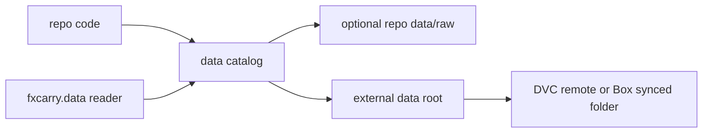

# FX Carry Harness And Research Direction

## Recommendation

Do not spend the project trying to fully replicate an entire paper first. Use the two papers as anchors:

- Burnside-Eichenbaum-Rebelo: return construction, carry trade setup, momentum extension.
- Lustig-Roussanov-Verdelhan, Common Risk Factors in Currency Markets: factor framing, DOL/HML-style interpretation, cross-sectional risk lens.

For your narrowed universe, the correct direction is a targeted replication plus application:

- First reproduce the basic FX excess-return mechanics on a small, auditable basket.
- Then run the supervisor-relevant strategy: fund in `JPY` and `CHF`, invest in `AUD`, `NZD`, `MXN`.
- Treat full-paper replication as validation material, not the final research goal.

A full LRV-style paper replication needs a broader cross-section. A 5-currency basket is too small to make a real HML factor, but it is good for a practical carry strategy study.

## Same-Day Harness Scope

Create a minimal, modular library under `[src/fxcarry](src/fxcarry)` that is useful immediately but does not absorb teammates' notebook code.

Suggested modules:

- `[src/fxcarry/config](src/fxcarry/config)`: currency baskets, data roots, ticker specs.
- `[src/fxcarry/data](src/fxcarry/data)`: data catalog, local/DVC-backed readers, Bloomberg pull interfaces.
- `[src/fxcarry/returns](src/fxcarry/returns)`: spot returns, forward-implied carry, FX excess returns.
- `[src/fxcarry/portfolio](src/fxcarry/portfolio)`: basket weights, funding/investment legs, portfolio returns.
- `[src/fxcarry/costs](src/fxcarry/costs)`: bid/ask and roll-cost placeholders.
- `[src/fxcarry/stats](src/fxcarry/stats)`: summary stats, drawdown, Sharpe, simple regressions.
- `[src/fxcarry/research](src/fxcarry/research)`: paper-replication entry points and experiment harnesses.

Keep only one top-level README for now: `[src/fxcarry/README.md](src/fxcarry/README.md)`.

## Data Design

Do not store raw Bloomberg data in git. Use a data-root abstraction:

Implementation idea:

- `FXCARRY_DATA_ROOT` environment variable points to the preferred external data folder.
- If unset, readers can fall back to existing `[data/raw](data/raw)` for compatibility.
- A tracked catalog file records logical datasets and filenames, not the raw data itself.
- DVC can later track raw files and push to a remote. For UChicago Box, the lowest-friction setup is usually a local Box-synced folder used as a DVC local remote; WebDAV may work only if Box/admin settings allow it.

## Bloomberg Pull Design

Make pulling easy to call, but keep it separate from return calculations:

- Define a small pull spec for the target universe: `JPY`, `CHF`, `AUD`, `NZD`, `MXN`.
- Pull spot, forwards or forward points, bid/ask, and optional rates/options only if needed.
- Save outputs in the same long/wide parquet convention so old and new datasets can coexist.
- Do not overwrite existing teammate data; write to a new dataset namespace such as `target_fx_spot_forward`.

## Research Milestones

1. Basket return mechanics:
   - Normalize quotes.
   - Compute long investment-currency returns versus USD.
   - Compute funding-currency short legs.
   - Combine into a JPY/CHF-funded AUD/NZD/MXN carry basket.

2. Paper-anchor validation:
   - Compare your return construction against Burnside-style excess return formulas.
   - Use LRV framing to explain whether the basket behaves like carry/HML exposure.

3. Supervisor-ready output:
   - Show annual return, volatility, Sharpe, drawdown, skew, and crisis-period behavior.
   - Keep assumptions explicit: funding weights, investment weights, rebalance frequency, costs, sample window.

## Guardrails

- Keep the harness small today: working skeleton plus a few core interfaces, not a full rewrite.
- Do not migrate teammates' notebooks yet.
- Do not commit unless explicitly requested.
- Use DVC as storage plumbing, not as a blocker for the first return calculation.
- Preserve compatibility with existing repo data because other teammates may prefer it.

## Proposed First Implementation Pass

- Flesh out `[src/fxcarry/config](src/fxcarry/config)` with target baskets and data-root settings.
- Add `[src/fxcarry/data](src/fxcarry/data)` readers that can load either external DVC data or existing `[data/raw](data/raw)` snapshots.
- Add `[src/fxcarry/returns](src/fxcarry/returns)` function stubs for quote normalization, carry, and excess returns.
- Add `[src/fxcarry/portfolio](src/fxcarry/portfolio)` function stubs for funding/investment basket construction.
- Add a concise `[src/fxcarry/README.md](src/fxcarry/README.md)` explaining the intended flow.

dataset selection -> data reader -> return construction -> basket portfolio -> stats/report